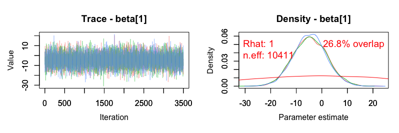
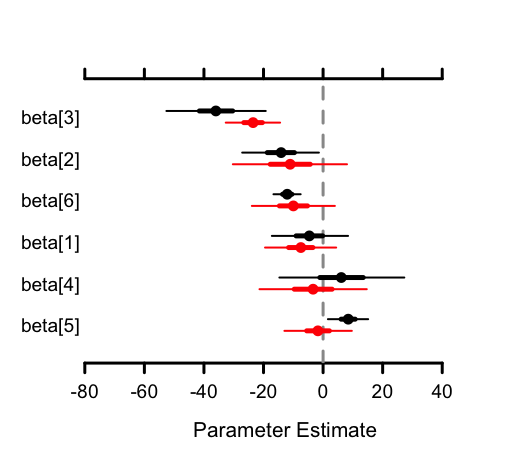

MCMCvis
====

[](http://cran.r-project.org/package=MCMCvis)  [](https://travis-ci.org/caseyyoungflesh/MCMCvis) [](https://doi.org/10.21105/joss.00640)


`MCMCvis` is an R package used to visualize, manipulate, and summarize MCMC output. MCMC output may be derived from Bayesian model output fit with JAGS, Stan, or other MCMC samplers.

The package contains five functions:

- `MCMCsummary` - summarize MCMC output for particular parameters of interest
- `MCMCpstr` - summarize MCMC output for particular parameters of interest while preserving parameter structure
- `MCMCtrace` - create trace and density plots of MCMC chains for particular parameters of interest
- `MCMCchains` - easily extract posterior chains from MCMC output for particular parameters of interest
- `MCMCplot` - create caterpillar plots from MCMC output for particular parameters of interest

`MCMCvis` was designed to perform key functions for MCMC analysis using minimal code, in order to free up time/brainpower for interpretation of analysis results. Functions support simple and straightforward subsetting of model parameters within the calls, and produce presentable and 'publication-ready' output.

**This package can be sighted as:**

Youngflesh, C. (2018) MCMCvis: Tools to visualize, manipulate, and summarize MCMC output. *Journal of Open Source Software*, 3(24), 640, https://doi.org/10.21105/joss.00640

Installation
------------

You can install the released verson on CRAN with:
```{r}
install.packages('MCMCvis')
```

Or the latest, development version from Github with:
```{r}
install.packages('devtools')
devtools::install_github('caseyyoungflesh/MCMCvis', build_vignettes = TRUE)
```

Vignette
--------

The vignette for this package can be run using:
```{r}
vignette('MCMCvis')
```

Examples
--------

#### Summarize

```{r}
data(MCMC_data)
MCMCsummary(MCMC_data, params = 'beta', round = 2, n.eff = TRUE)
#>           mean   sd   2.5%    50%  97.5% Rhat n.eff
#> beta[1]  -13.83 5.53 -24.67 -13.78  -2.96    1 18000
#> beta[2]   -5.60 0.14  -5.88  -5.60  -5.32    1 17868
#> beta[3]  -16.82 1.71 -20.15 -16.82 -13.45    1 18279
#> beta[4]  -19.55 2.61 -24.59 -19.55 -14.41    1 17714
#> beta[5]    8.68 5.26  -1.66   8.69  19.04    1 18435
#> beta[6]    2.86 7.68 -12.04   2.83  17.93    1 17754
#> beta[7]    2.06 7.78 -13.11   2.01  17.27    1 18000
#> beta[8]  -15.95 3.62 -23.08 -15.93  -8.93    1 17904
#> beta[9]    8.44 4.64  -0.69   8.44  17.58    1 17949
#> beta[10]  16.69 4.36   8.24  16.66  25.40    1 18993
```

#### Evaluate

```{r}
PR <- rnorm(15000, 0, 32)
MCMCtrace(MCMC_data, params = 'beta\\[1\\]', ISB = FALSE, priors = PR)
```



#### Manipulate

```{r}
just_betas_mcmc_obj <- MCMCchains(MCMC_data, params = 'beta', mcmc.list = TRUE)
```

#### Visualize

```{r}
MCMCplot(MCMC_data, 
       params = 'beta', 
       rank = TRUE,
       horiz = FALSE, 
       ref_ovl = TRUE)
```

